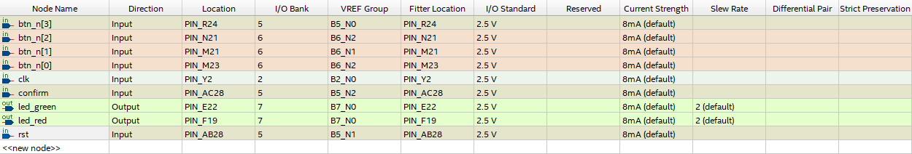
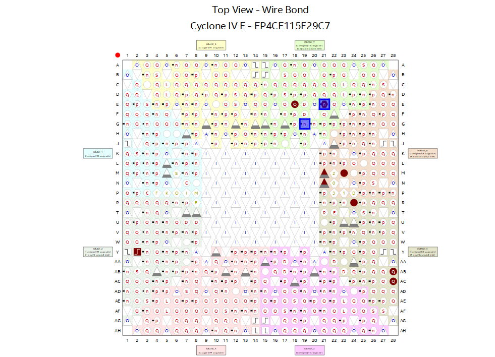

# SafeCrack Pro: Cofre Digital com Senha Programável em SystemVerilog

## Visão Geral

Este repositório contém o projeto final da disciplina de Sistemas Digitais do Centro de Informática (CIn) da Universidade Federal de Pernambuco (UFPE). O projeto, intitulado **"SafeCrack Pro"**, consiste na reimplementação e extensão de um cofre digital com uma Máquina de Estados Finitos (FSM) em SystemVerilog, projetado para a placa FPGA DE2-115.

A principal característica desta implementação é a regra de segurança de **"Tolerância Zero"**: uma única tentativa de senha incorreta resulta em um bloqueio imediato do sistema por 10 segundos.

## Funcionalidades Implementadas

* **Senha Programável:** O usuário pode definir uma nova senha de três dígitos ao entrar no modo de programação.
* **Feedback Visual:** LEDs na placa DE2-115 são utilizados para fornecer feedback em tempo real sobre o status do sistema, indicando progresso, sucesso, erro e o estado de bloqueio.
* **Bloqueio por "Tolerância Zero":** Após uma única tentativa com a combinação de 3 dígitos incorreta, o sistema entra em um estado de bloqueio por 10 segundos.
* **Entradas Físicas Robustas:** O design inclui sincronizadores de dois estágios e lógica de detecção de borda de descida para as entradas dos botões, garantindo que cada pressionamento seja registrado de forma limpa e evitando problemas de metaestabilidade.

## Estrutura da Máquina de Estados (FSM)

A FSM é o núcleo de controle do projeto, gerenciando todo o fluxo de operação. Ela foi desenhada com estados explícitos para cada etapa, garantindo clareza e robustez na lógica. Os principais estados são:

* **`S_IDLE` (Ocioso):** Estado inicial e de repouso do sistema. Aguarda a ativação do modo de programação ou o início de uma tentativa.
* **`S_PROGRAM` (Programação):** Ativado pela chave `confirm` (SW1). Permite a inserção de uma nova senha de 3 dígitos pressionando os botões KEY.
* **`S_INPUT_1`, `S_INPUT_2`, `S_INPUT_3`:** Estados de espera pela entrada de cada um dos três dígitos durante uma tentativa de desbloqueio.
* **`S_FEEDBACK_1`, `S_FEEDBACK_2`, `S_FEEDBACK_3`:** Estados temporários que fornecem feedback visual (pisca o LED verde) se o dígito inserido estiver correto.
* **`S_CHECK` (Verificação):** Estado transitório que compara a senha digitada com a senha armazenada para decidir entre sucesso ou falha.
* **`S_UNLOCKED` (Destravado):** Estado de sucesso. O cofre está aberto e o LED verde permanece aceso.
* **`S_LOCKED` (Bloqueado):** Estado de falha ativado após uma tentativa incorreta. O sistema fica bloqueado por 10 segundos com o LED vermelho aceso.

### Mapa de Pinos

### Modo de Programação

1.  Ligue a chave `confirm` (SW1) para entrar no modo de programação (`S_PROGRAM`).
2.  Pressione três botões (`KEY0` a `KEY3`) em sequência para definir os três dígitos da sua senha.
3.  Desligue a chave `confirm` (SW1). O sistema salvará a senha se 3 dígitos tiverem sido inseridos e retornará ao estado `S_IDLE`.

### Modo de Verificação

1.  Certifique-se de que a chave `confirm` (SW1) esteja desligada. O sistema estará em um dos estados `S_INPUT`.
2.  Insira os três dígitos da senha, um por vez.
3.  **Feedback:** A cada dígito correto, o LED verde piscará por meio segundo.
4.  **Resultado:**
    * **Senha Correta:** Após o terceiro dígito correto, o sistema entrará em `S_UNLOCKED` e o LED verde ficará aceso continuamente.
    * **Senha Incorreta:** O sistema entrará em `S_LOCKED`, e o LED vermelho ficará aceso por 10 segundos.

## Problemas Conhecidos

* A simulação no Waveform não se comportou de maneira consistente com os testes realizados na placa física.
* Deixar as chaves de `confirm` e `reset` ligadas simultaneamente pode causar um mau funcionamento temporário do sistema.
* A lógica de bloqueio atual só é ativada após a inserção da combinação completa dos 3 dígitos. Não há um feedback claro de erro para dígitos parciais, o que pode confundir o usuário.

## Autores

* Luiz Taiguara de Oliveira Guimarães `<ltog>`
* Henrique Lima `<hsl3>`
* Mateus Barbosa `<mbos>`
* Mateus Martins `<mmb2>`
